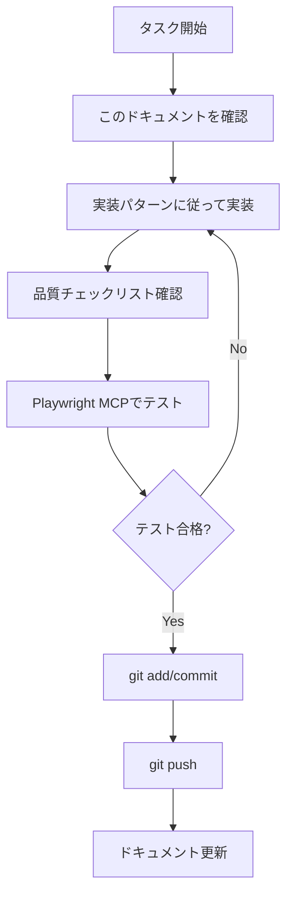

# 📋 ENTP 英語学習アプリ - マスター開発ガイド

**最終更新**: 2025 年 10 月 1 日  
**ステータス**: Phase 4 (高度最適化) 95%完了  
**次期フォーカス**: 品質向上・テスト充実・ドキュメント整備

---

## 🎯 このドキュメントの目的

このドキュメントは、ENTP 英語学習アプリの**実装タスクの唯一の参照ドキュメント**です。

### 使い方

1. **新規タスク開始時**: 該当セクションを確認
2. **実装中**: 実装パターンと品質チェックリストを参照
3. **完了後**: 進捗を更新し、次のタスクへ

---

## 🚨 プロジェクトの重大懸念点と対策

### 懸念点 1: 継続率の低さ（最重要）

**問題**：

- ユーザー（開発者自身）は英会話を 3 ヶ月で辞めた経験がある
- 「いつかは克服したい」という漠然とした目標では継続困難
- 機能が多すぎて何から始めればいいか分からなくなる可能性

**対策**：

#### A. 明確なゴール設定システム（優先度：最高）

実装タスク：

1. **学力診断テスト機能**

   - 現在地の正確な把握（TOEIC 推定スコア、文法理解度、語彙力）
   - 所要時間：10 分以内
   - 実装場所：`src/components/DiagnosticTest.tsx`

2. **3 ヶ月目標設定ウィザード**

   - 現在地から達成可能な目標を提案
   - 例：TOEIC320 点 → 450 点（+130 点）
   - 毎日の必要学習時間を明示：15-20 分
   - 実装場所：`src/components/GoalSettingWizard.tsx`

3. **週次チェックポイント機能**
   - 毎週月曜日に進捗確認
   - 「今週の目標」の自動生成
   - 達成度の可視化
   - 実装場所：`src/components/WeeklyCheckpoint.tsx`

#### B. コア機能の絞り込み（優先度：高）

現在の機能リストから、**初期画面で表示する機能を 5 つに絞る**：

```typescript
interface CoreFeatures {
  // 必須5機能（他は「もっと見る」に格納）
  core: [
    "語彙学習（ガチャ連携）",
    "文法クイズ（基礎のみ）",
    "日替わりクエスト",
    "学習進捗ダッシュボード",
    "週次チェックポイント"
  ];

  // 7日後にアンロック
  advanced: ["タイムアタック", "タワーディフェンス", "英作文", "総合テスト"];

  // 30日後にアンロック
  expert: ["統合学習システム", "弱点分析", "事前学習コンテンツ"];
}
```

実装タスク：

- `src/components/Home.tsx` の修正
- 機能アンロックシステムの実装
- ユーザーデータに `unlockedFeatures` フィールド追加

#### C. 成長の可視化強化（優先度：高）

実装タスク：

1. **成長ダッシュボード**

   - 1 週間前の自分との比較
   - 予測 TOEIC スコアのグラフ
   - 学習時間の推移
   - 実装場所：`src/components/GrowthDashboard.tsx`

2. **マイルストーン通知**

   ```typescript
   interface Milestones {
     初めての7日連続: "🎉 素晴らしい！習慣化の第一歩です";
     累計100問達成: "💯 100問クリア！確実に成長しています";
     "正答率70%突破": "📈 理解度が上がってきました！";
     "予測スコア+50点": "🚀 TOEICスコア50点アップ予測！";
   }
   ```

3. **「できるようになったこと」リスト**
   - 1 ヶ月前は間違えていた問題が今は正解できる
   - 具体的な成長の提示
   - 実装場所：成長ダッシュボード内

### 懸念点 2: 「暗記は苦手」への対応不足

**問題**：

- ユーザーは「暗記は苦手」と明言している
- 現在のシステムは反復学習が前提
- 意識的な暗記が必要な設計になっている

**対策**：

#### A. 無意識の反復学習システム（優先度：最高）

実装タスク：

1. **文脈による自然な再出現**

   ```typescript
   interface ContextualReappearance {
     // 同じ単語を異なる文脈で出現させる
     word: "accomplish";
     contexts: [
       "文法クイズ内で自然に使用",
       "英作文の例文に含める",
       "ガチャカードの説明文に登場",
       "デイリークエストの問題文で使用"
     ];
     // ユーザーは「復習している」と気づかない
     repetitionCount: 5;
     retention: "85%"; // 無意識の反復による定着率
   }
   ```

2. **ゲーム内での自然な接触**

   - タワーディフェンスの敵の名前に英単語を使用
   - 宝箱の説明文に頻出単語を含める
   - アチーブメント名に英語表現を使用
   - 「暗記」という言葉を一切使わない

3. **「復習」を「復習」と呼ばない**

   ```typescript
   // ❌ 悪い例
   "今日の復習タイム";
   "苦手な単語を復習しましょう";

   // ✅ 良い例
   "今日のラッキー問題";
   "あなたが強くなる問題セット";
   "成長加速チャレンジ";
   ```

実装場所：

- `src/utils/contextualLearning.ts` - 新規作成
- `src/data/vocabulary.ts` - 文脈データ追加
- 各コンポーネントでの用語変更

### 懸念点 3: モチベーション維持の仕組み不足

**問題**：

- 「いつかは克服したい」という気持ちだけでは続かない
- 長期目標（TOEIC800 点）は遠すぎてモチベーション低下
- 日々の達成感が不足

**対策**：

#### A. 毎日の小さな勝利システム（優先度：最高）

実装タスク：

1. **1 日 3 回の達成感設計**

   ```typescript
   interface DailyWins {
     morning: {
       task: "朝の単語クイズ5問";
       time: "3分";
       reward: "朝活ボーナス +50XP";
       message: "素晴らしい1日のスタート！";
     };
     lunch: {
       task: "昼休みの文法1問";
       time: "1分";
       reward: "ランチタイムボーナス +30XP";
       message: "休憩時間を有効活用！";
     };
     evening: {
       task: "寝る前の復習3問";
       time: "2分";
       reward: "就寝前ボーナス +40XP";
       message: "今日も継続できました！";
     };
   }
   ```

2. **ストリーク保護システム**

   - 忙しくて学習できない日用の「保護カード」
   - 月 3 回まで使用可能
   - ストリークが途切れても「明日から再スタート」と前向きなメッセージ
   - 実装場所：`src/utils/streakProtection.ts`

3. **緊急モチベーション回復**
   ```typescript
   interface MotivationRecovery {
     // 3日間ログインがない場合
     trigger: "3日間未ログイン";
     actions: [
       "これまでの成長データを含むメール送信",
       "「あと1問だけ」の超短時間チャレンジ提案",
       "仲間の成長ストーリー紹介",
       "休学オプションの提示（データは保存）"
     ];
   }
   ```

#### B. ソーシャルプルーフ（優先度：中）

実装タスク：

1. **匿名の仲間システム**

   - 「今、同じ時間に 127 人が学習中」
   - 「今週、あなたと同じレベルの人が平均 85 問解きました」
   - 競争ではなく、一体感の演出

2. **マイルストーン達成者の紹介**
   - 「A さん（28 歳・エンジニア）が 3 ヶ月で TOEIC+150 点達成」
   - 具体的な学習パターンの紹介
   - 「あなたも同じペースです」というメッセージ

実装場所：

- `src/components/CommunityMotivation.tsx`
- バックエンド不要（ダミーデータで OK）

### 実装優先順位

#### 🔥 今週中に実装（Phase 1）

- [ ] 学力診断テスト
- [ ] 3 ヶ月目標設定ウィザード
- [ ] コア機能の絞り込み（ホーム画面修正）
- [ ] 成長ダッシュボード基本版
- [ ] 毎日の小さな勝利システム

#### ⚡ 2 週間以内に実装（Phase 2）

- [ ] 週次チェックポイント
- [ ] 文脈による自然な再出現システム
- [ ] ストリーク保護システム
- [ ] 用語変更（「復習」を使わない）
- [ ] マイルストーン通知

#### 📈 1 ヶ月以内に実装（Phase 3）

- [ ] 機能アンロックシステム
- [ ] 緊急モチベーション回復
- [ ] 匿名の仲間システム
- [ ] 成長ダッシュボード完全版

---

## 📊 現在の状況（2025 年 10 月 1 日）

### ✅ 完了済み機能（95%）

#### 基本学習機能（100%）

- ✅ 語彙学習（レベル別・カテゴリー別・ガチャ専用・基本単語専用）
- ✅ 文法クイズ（9 カテゴリー × 3 難易度）
- ✅ 拡張文法クイズ（問題セット分割システム：30 問 → 6 セット × 5 問）
- ✅ 英作文機能（創造的ライティング）
- ✅ 総合テスト機能
- ✅ タイムアタックモード
- ✅ タワーディフェンスゲーム

#### 高度なゲーミフィケーション（100%）

- ✅ ガチャシステム（TOEIC カード収集）
- ✅ アドレナリンシステム（コンボ・クリティカル・フィーバー）
- ✅ 宝箱システム（学習報酬）
- ✅ ハートシステム（体力管理）
- ✅ スターシステム（事前学習エネルギー）
- ✅ XP ショップ（アイテム交換）
- ✅ 日替わりクエスト（ストリーク管理）

#### インテリジェント学習（90%）

- ✅ 個人化学習システム
- ✅ 統合学習システム
- ✅ 適応的難易度調整
- ✅ 弱点分析システム
- ✅ 学習インサイト・改善提案

#### 技術・UX（100%）

- ✅ PWA 機能（インストール・オフライン対応）
- ✅ データ管理システム
- ✅ 統一ログシステム
- ✅ エラーハンドリング（AppError クラス）
- ✅ パフォーマンス最適化

### 🔄 進行中・未完了タスク（5%）

#### 高優先度

- [ ] ユーザビリティテストの実施
- [ ] 監視システムの設定（エラー監視・パフォーマンス監視）
- [ ] ユーザーガイドの作成

#### 中優先度

- [ ] ユニットテストの実装（主要コンポーネント）
- [ ] 統合テストの実装
- [ ] E2E テストの拡充（現在：Playwright MCP 対応済み）

#### 低優先度

- [ ] リリースノートの作成
- [ ] 追加パフォーマンス最適化
- [ ] アクセシビリティの更なる向上

---

## 🚀 次期タスク（優先順位順）

### 1. VocabularyCard.tsx のリファクタリング（高優先度）

**理由**: 850 行の大規模コンポーネントは保守性・可読性に問題

**目標**:

- コンポーネントを 4-5 個に分割
- ビジネスロジックをカスタムフックに抽出
- テストしやすい構造に改善

**実装パターン**: [セクション 3.1 を参照](#31-大規模コンポーネントのリファクタリング)

### 2. 新機能の統合テスト（高優先度）

**対象機能**:

- `gacha-only`モード（ガチャ専用単語学習）
- `basic-only`モード（基本単語専用学習）
- 既知単語フィルタリング機能

**実装パターン**: [セクション 3.2 を参照](#32-playwright-mcpによる統合テスト)

### 3. ユーザビリティテスト（中優先度）

**目的**: 実際のユーザーフィードバックに基づく改善

**実施内容**:

- ユーザージャーニーテスト（5-10 名）
- 学習継続率の測定
- UI/UX 改善ポイントの特定

### 4. 監視システムの設定（中優先度）

**目的**: 本番環境での品質維持

**実施内容**:

- エラー監視（Sentry 等）
- パフォーマンス監視（Core Web Vitals）
- ユーザー分析（Google Analytics 等）

---

## 💡 実装パターン

### 3.1 大規模コンポーネントのリファクタリング

#### Step 1: 現状分析

```bash
# Serena MCPで現在の構造を分析
mcp_serena_get_symbols_overview("src/components/VocabularyCard.tsx")
```

#### Step 2: 分割設計

**推奨構成**:

```
src/components/vocabulary/
├── VocabularyCardContainer.tsx  # 状態管理・データ取得
├── VocabularyCardView.tsx       # 表示ロジック
├── VocabularyCardComplete.tsx   # 完了画面
├── VocabularyCardError.tsx      # エラー画面
└── hooks/
    └── useVocabularySession.ts  # ビジネスロジック
```

#### Step 3: 段階的実装

1. **カスタムフック抽出**（最優先）

```typescript
// hooks/useVocabularySession.ts
export function useVocabularySession(
  difficulty: Difficulty,
  category: Category
) {
  const [words, setWords] = useState<VocabularyWord[]>([]);
  const [session, setSession] = useState<StudySession>(initialSession);

  // ビジネスロジックをここに集約

  return {
    words,
    session,
    currentWord,
    handleAnswer,
    handleRestart,
  };
}
```

2. **表示コンポーネント分離**

```typescript
// VocabularyCardView.tsx
export default function VocabularyCardView({
  currentWord,
  session,
  onAnswer,
  onToggleMeaning,
}: VocabularyCardViewProps) {
  // 表示ロジックのみ
}
```

3. **コンテナコンポーネント統合**

```typescript
// VocabularyCardContainer.tsx
export default function VocabularyCardContainer() {
  const session = useVocabularySession(difficulty, category);

  return <VocabularyCardView {...session} />;
}
```

#### Step 4: テスト作成

```typescript
// __tests__/useVocabularySession.test.ts
describe("useVocabularySession", () => {
  it("should initialize with correct word count", () => {
    const { result } = renderHook(() =>
      useVocabularySession("intermediate", "all")
    );
    expect(result.current.words).toHaveLength(20);
  });
});
```

#### Step 5: 品質チェックリスト

- [ ] 各ファイルが 200 行以内
- [ ] ビジネスロジックがカスタムフックに集約
- [ ] 表示ロジックが純粋関数
- [ ] 型定義が適切
- [ ] テストカバレッジ 80%以上

---

### 3.2 Playwright MCP による統合テスト

#### Step 1: テスト環境準備

```bash
# 開発サーバー起動（別ターミナル）
npm run dev

# Playwright MCPサーバーが起動していることを確認
```

#### Step 2: テストシナリオ作成

**ガチャ専用モードのテスト**:

```typescript
// tests/vocabulary-gacha-only.spec.ts
test("ガチャ専用モードで正しく動作する", async ({ page }) => {
  // 1. ページにアクセス
  await page.goto(
    "http://localhost:3000/learning/vocabulary/gacha-only/intermediate"
  );

  // 2. ガチャカードが表示されることを確認
  await expect(page.locator('[data-testid="vocabulary-card"]')).toBeVisible();

  // 3. 単語が表示されることを確認
  const wordText = await page
    .locator('[data-testid="word-text"]')
    .textContent();
  expect(wordText).toBeTruthy();

  // 4. 「知ってる」ボタンをクリック
  await page.click('button:has-text("知ってる")');

  // 5. 次の単語に移動することを確認
  await expect(page.locator('[data-testid="vocabulary-card"]')).toBeVisible();
});
```

#### Step 3: Playwright MCP 経由での実行

```javascript
// MCP経由でブラウザを起動してテストを実行
mcp_playwright - mcp_browser_navigate({ url: "http://localhost:3000" });
mcp_playwright - mcp_browser_snapshot(); // ページ状態を取得
mcp_playwright -
  mcp_browser_click({
    element: "語彙学習ボタン",
    ref: "button-vocabulary",
  });
```

#### Step 4: 品質チェックリスト

- [ ] 全 36 ページの動作確認（基本 21 + 深い階層 15）
- [ ] ユーザージャーニーの完全テスト
- [ ] エラーハンドリングの動作確認
- [ ] JavaScript エラー 0 件
- [ ] ナビゲーション動作正常

---

### 3.3 新機能開発の標準フロー

#### Step 1: 要件確認

1. **ドキュメント確認**

   - requirements.md（機能要件）
   - tech-specs.md（技術仕様）
   - customer-journey.md（ユーザー体験）

2. **既存実装確認**

```bash
# Serena MCPで類似機能を検索
mcp_serena_search_for_pattern({
  substring_pattern: "類似機能名",
  relative_path: "src/components"
})
```

#### Step 2: 設計

1. **コンポーネント設計**

   - Router 対応で作成（default export 必須）
   - props 形式は禁止
   - lazy loading 禁止（直接 import 使用）

2. **型定義作成**

```typescript
// types/newFeature.ts
export interface NewFeatureProps {
  // 型定義
}
```

#### Step 3: 実装

1. **shadcn/ui コンポーネント確認**

   - 既存コンポーネントで代替可能か確認
   - カスタムコンポーネントで対応可能か確認

2. **実装**

```typescript
// components/NewFeature.tsx
import { Button, Card } from "./ui/...";

export default function NewFeature() {
  // 実装
}
```

#### Step 4: テスト

1. **Playwright MCP で動作確認**

```javascript
mcp_playwright -
  mcp_browser_navigate({ url: "http://localhost:3000/new-feature" });
mcp_playwright - mcp_browser_snapshot();
```

2. **エラーコンソール確認**
   - JavaScript エラー 0 件であること

#### Step 5: 品質チェックリスト

- [ ] TypeScript 型定義が適切
- [ ] アクセシビリティ（WCAG 2.1 AA 準拠）
- [ ] レスポンシブデザイン対応
- [ ] デザインシステムに準拠
- [ ] Playwright MCP でテスト完了
- [ ] エラー 0 件

---

## 📝 品質基準

### 4.1 コード品質

#### TypeScript

- [ ] 厳密な型チェック適用
- [ ] インターフェース明確定義
- [ ] 型の安全性最優先
- [ ] `any`型の使用禁止

#### React

- [ ] 関数コンポーネント使用
- [ ] カスタムフックでロジック分離
- [ ] プロップスの型定義必須
- [ ] 不要な再レンダリング回避

#### スタイリング

- [ ] Tailwind CSS v4 ユーティリティクラス使用
- [ ] shadcn/ui コンポーネント優先
- [ ] レスポンシブデザイン必須
- [ ] アクセシビリティ考慮

### 4.2 パフォーマンス

- [ ] バンドルサイズ監視
- [ ] 読み込み時間最適化（LCP < 2.5s）
- [ ] メモリ使用量管理
- [ ] 不要な再レンダリング防止

### 4.3 アクセシビリティ

- [ ] WCAG 2.1 AA 準拠
- [ ] キーボード操作対応
- [ ] スクリーンリーダー対応
- [ ] カラーコントラスト 4.5:1 以上

---

## 🚨 重要な注意事項

### 真っ白ページ問題予防

**✅ 必須ルール**:

1. 新規コンポーネントは Router 対応で作成
2. default export を使用（named export 禁止）
3. props 形式のコンポーネント作成禁止
4. lazy loading 使用禁止（直接 import 使用）

**✅ 変更後の必須確認**:

1. Playwright MCP で該当ページの動作確認
2. エラーコンソールの確認（0 件であること）
3. ナビゲーション動作の確認
4. 関連ページへの影響確認

### Git Push エラー対応

**❌ 禁止**: `git push --no-verify`の使用

**✅ 正しい対応**:

1. エラー分析
2. 優先度判定（重大・警告・軽微）
3. 段階的修正
4. テスト実行
5. 正常プッシュ

---

## 🔄 開発ワークフロー

### 日常の開発フロー



### コミット・プッシュ前チェックリスト

- [ ] 動作確認（手動テスト）
- [ ] エラーハンドリングの確認
- [ ] レスポンシブデザインの確認
- [ ] アクセシビリティの確認
- [ ] ドキュメントの更新

---

## 📚 参考ドキュメント

### 必読ドキュメント

1. **[tech-specs.md](./tech-specs.md)** - 技術仕様の詳細
2. **[requirements.md](./requirements.md)** - 機能要件の詳細
3. **[customer-journey.md](./customer-journey.md)** - ユーザー体験の詳細

### 補助ドキュメント

- **[project-snapshot.md](./project-snapshot.md)** - 現在の進捗状況
- **[timeline.md](./timeline.md)** - 開発スケジュール
- **[overview.md](./overview.md)** - プロジェクト概要

---

## 📞 トラブルシューティング

### よくある問題と解決策

#### 問題 1: コンポーネントが表示されない

**原因**: lazy loading の設定ミス

**解決策**:

```typescript
// ❌ 誤り
const Component = lazy(() => import("./Component"));

// ✅ 正しい
import Component from "./Component";
```

#### 問題 2: TypeScript エラーが消えない

**原因**: 型定義の不一致

**解決策**:

```bash
# 型チェック実行
npm run type-check

# Serenaで型定義を確認
mcp_serena_find_symbol({ name_path: "型名", relative_path: "types/" })
```

#### 問題 3: テストが失敗する

**原因**: テストデータの不一致

**解決策**:

```bash
# Playwright MCPで実際の動作を確認
mcp_playwright-mcp_browser_navigate({ url: 'テストURL' })
mcp_playwright-mcp_browser_console_messages() # コンソールエラー確認
```

---

## 🎯 成功基準

### 短期（1 週間）

- [ ] VocabularyCard.tsx のリファクタリング完了
- [ ] 新機能の統合テスト完了
- [ ] ドキュメントの整合性確保

### 中期（1 ヶ月）

- [ ] ユーザビリティテスト実施
- [ ] 監視システムの設定完了
- [ ] ユーザーガイドの作成完了

### 長期（3 ヶ月）

- [ ] ユニットテストカバレッジ 80%以上
- [ ] ユーザー継続率 70%以上
- [ ] アプリストア評価 4.5 以上

---

**このガイドは常に最新の状態に保たれます。変更があった場合は必ず更新してください。**

_最終更新者: AI Assistant_  
_最終更新日: 2025 年 10 月 1 日_
